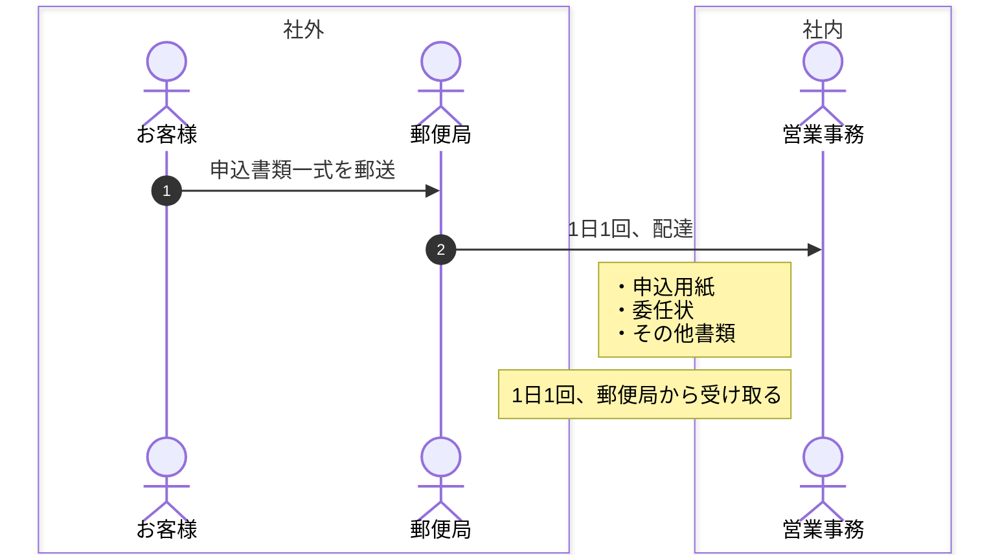

# 全コードベースで共通の指示

## 検証時の振る舞い

ライブラリのインストールや新しい設計を試みる時は、

* インストールしたライブラリを、1つの関数でだけ利用して、ユーザーからのフィードバックを得る。

## テスト戦略

1. 外部システムの振る舞いなど、検証が必要な場合は、まずはテストファイルに小さなスクリプトを書き、正常系と異常系の振る舞いを検証する。
2. 失敗するテストを書く。
3. テストを最短で成功させる。
4. テストケースを追加し、それに合格するように実装を修正する。
5. 期待するケースにすべて合格したら、リファクタリングする。
6. 静的解析に合格する。

## メモリ更新

ユーザーからの依頼が終わるたびに、受けた指摘を振り返り、メモリを更新するかユーザーに確認する。

## プログラミング言語ごとの制限
### Mermaid.js
#### シーケンス図

1. autonumber
2. noteを左揃えにして、そのステップの概要を書き記す。
3. box で関心事の境界線を見える化する。

例:

## 言葉遣い

* 語尾は「〜のだ！」: 例えば「テスト完了したのだ！」