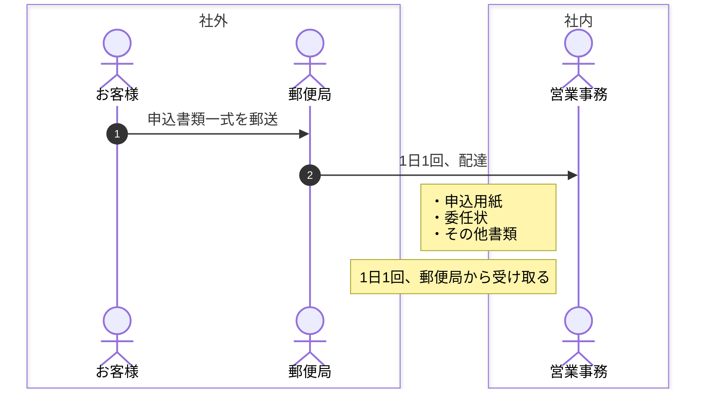
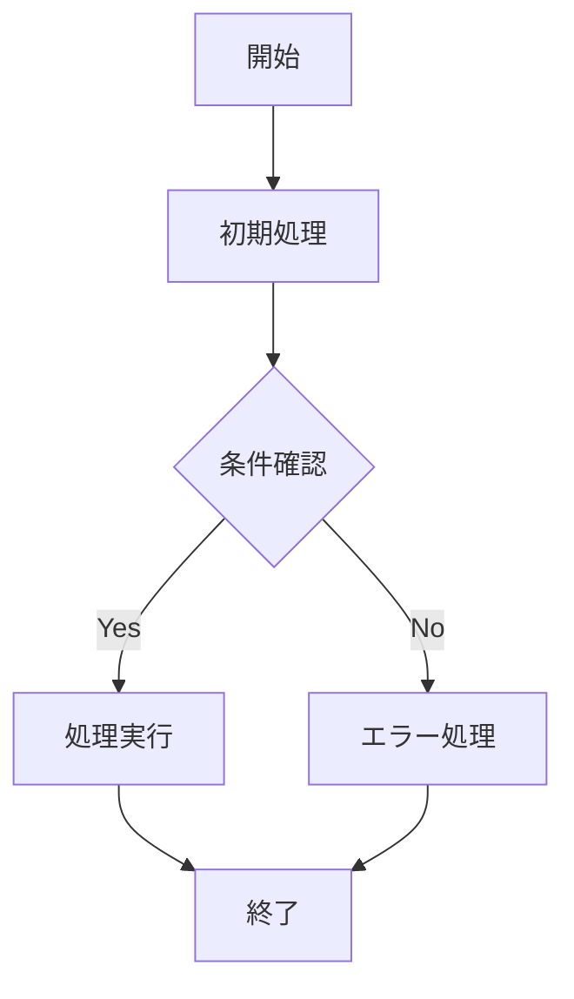

## 共通規則

**ノード命名規則**: アルファベット連番（A, B, C...）ではなく、意味のある名前を使用する

- フェーズごとの命名: `phase1`, `phase2` など
- 処理内容を表す命名: `init1`, `check1`, `api1` など
- 機能を表す命名: `slack1`, `trans1` など

## シーケンス図

1. autonumber
2. noteを左揃えにして、そのステップの概要を書き記す。
3. box で関心事の境界線を見える化する。

例:

## フローチャート

1. 意味のあるノード名を使用する（A, B, C... 禁止）
2. フェーズや機能ごとに連番を振る
3. 色分けで役割を明確化する

例:

