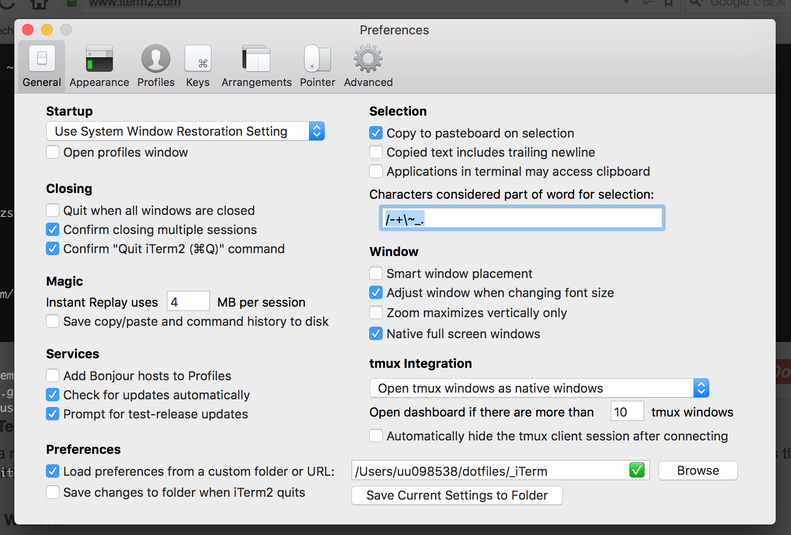

# dotfiles

## outline

Setup development environment for me.

## Getting ready

```
cd ~
git clone https://github.com/blackawa/dotfiles.git
```

## Initialize vim

    cd ~/dotfiles
    git submodule init
    git submodule update
    ln -s ./dotfiles/_vimrc ~/.vimrc
    vim
    # Install NeoBundle dependencies

## Initialize emacs

    brew install cask
    cd ~/dotfiles
    ln -s ./dotfiles/_emacs.d ~/.emacs.d
    cd _emacs.d
    cask install

## Install tmux

    brew install tmux
    ln -s ./dotfiles/_tmux.conf ~/.tmux.conf

## Install rbenv

    brew install rbenv

## Install zsh

    brew install zsh
    ln -s ./dotfiles/_zshrc ~/.zshrc
    sudo vim /etc/shells
    # add /usr/local/bin/zsh
    chsh -s /usr/local/bin/zsh

    git clone https://github.com/tarjoilija/zgen.git "${HOME}/.zgen"
    # reboot terminal

## Copy git configuration

    cp ./dotfiles/_git.commit.template ~/.git.commit.template
    cp ./dotfiles/_gitconfig ~/.gitconfig
    vim ~/.gitconfig # and add username and email to this config file.

## Copy iTerm configuration

Install iTerm from https://www.iterm2.com

Run

    cd ~/dotfiles
    mkdir iTerm
    cp com.googlecode.iterm2.plist iTerm

Then open iTerm and detect configuration directory in preference window.



After that, restart iTerm
